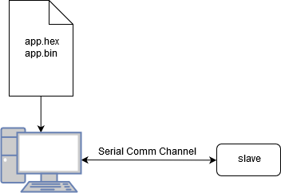
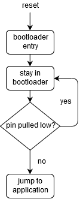
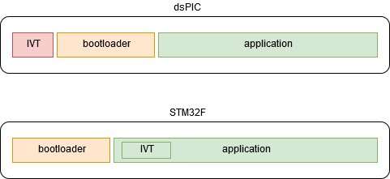

=====================
The Big Ideas
=====================

----------------------------
Master/Slave Model
----------------------------

The typical implementation of the bootloader involves having a master - which directs all of the action - and
a slave device which simply executes those commands.  In this way, it is possible to implement several different
workflows on the master while the slave device blindly executes those instructions.  The master will be able
to command the slave device to execute any command supported by the protocol.

----------------------------
Entry into the Bootloader
----------------------------

The bootloader is automatically entered upon a device reset.  Depending on the configuration and hardware, there
are various conditions that may be present that will allow the bootloader to simply "fall through" to the
application or to initialize the bootloader itself.

One of the most common methods for staying in a bootloader is to simply pull a pre-defined pin low within the
application.  In this case, the device stays in the bootloader for as long as the pin is pulled low.

Another method supported by booty is to stay in the bootloader for a time after reset or after the most recent
valid message has been received.  This method has the advantage of requiring no additional hardware, but the
disadvantage of slow application startup time.

----------------------------
Device Memory Map
----------------------------

There are two primary areas of concern for applications which require a bootloader.  The first and foremost
is the bootloader itself.  It is expected that ``booty`` will reside somewhere in the beginning memory of the
device.  The exact location of the bootloader should be stored within the bootloader itself so that it may
protect itself from erasure.

The application must have some offset applied to its starting address in order to allow the bootloader room to
reside.  This offset is device-specific, but is made directly available through the communications protocol
using the READ_APP_START_ADDRESS command.

Different device architectures require different memory maps and strategies.  For instance, in the dsPIC
series, the interrupt vector table is always located at or near the beginning of the device memory.  As
a result, the bootloader must be located such that it is after the hardware-defined interrupt vector
table (IVT) but before the application.  It is also very advantageous that the bootloader itself does not
utilize interrupts so that the application may fully utilize the hardware-defined IVT.

The ARM architecture, on the other hand, supports offsetting the entire IVT within the application, making it
relatively easy to locate the bootloader at the beginning of the memory and the application a defined offset
from that point.

Generally, a customer linker script will be utilized to impose image location requirements on the bootloader
and the application.
